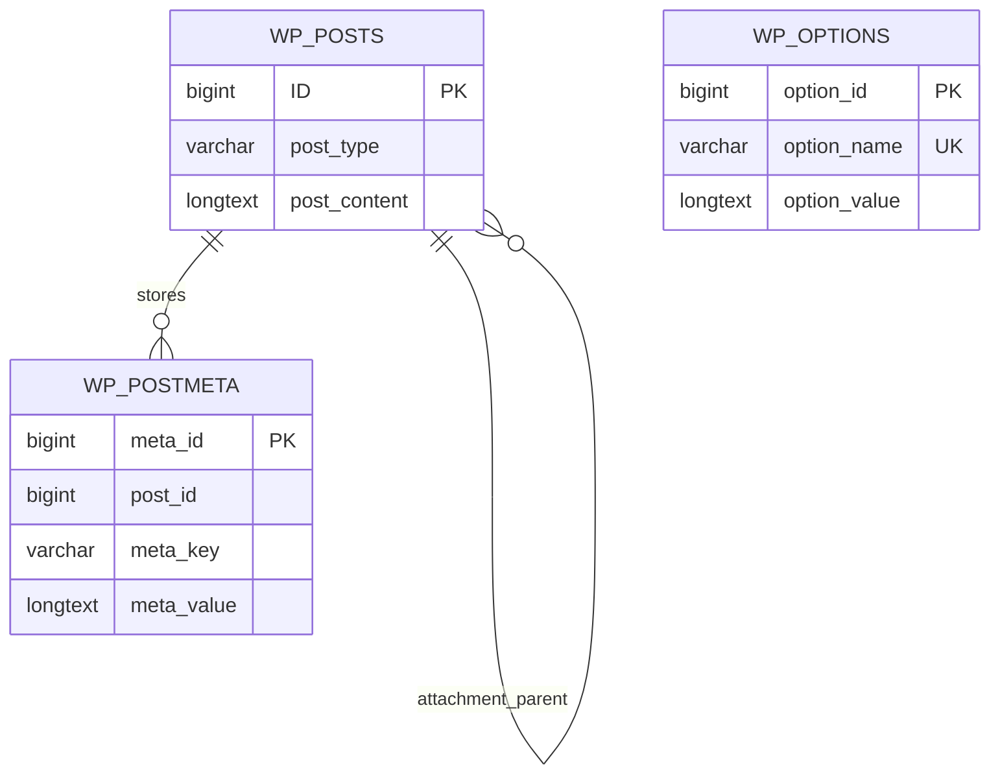

# Storage schema — Portare Product Gallery 0.1.1

No custom tables, no migration/version option, and no activation data writes. Existing absent or malformed metadata normalizes on read. Settings API stores `ppg_settings`; only the plugin's two metadata keys are written by the product save handler.

## Product `_ppg_config`

`PPG::config($product_id)` returns this exact normalized structure:

```php
[
  'enabled' => 0,         // integer 0|1; automatic integration opt-in
  'placement' => 'auto',  // auto|shortcode
  'text_side' => 'left',  // left|right
  'quote_enabled' => 1,   // integer 0|1
  'quote_align' => 'left',// left|center|right
  'autoplay' => 0,        // integer 0|1
  'interval' => 5,        // seconds, bounded 1..120, decimal accepted
]
```

`enabled` gates automatic integration, NOT explicit shortcode rendering. `placement=shortcode` prevents automatic hooks even if enabled. Frontend `data-interval` uses milliseconds; the stored `interval` is seconds.

## Product `_ppg_slides`

Ordered list, up to 100 rows, normalized and deduplicated by positive image attachment ID:

```php
[
  ['id' => 123, 'description' => '<p>Rich paragraph</p>', 'x' => 50, 'y' => 50, 'zoom' => 100],
]
```

`x/y` clamp to 0..100 percent; zoom clamps to 100..200 percent. Description allows paragraphs, headings h2/h3/h4, emphasis, lists, blockquotes, span without attributes, and links with href/title. No arbitrary CSS, scripts, images, iframes, or event attributes. WordPress KSES validates allowed link protocols.

A nonempty valid custom list replaces the WooCommerce gallery association list; the product's featured image is still prepended and deduplicated so it remains the initial image. Reordering affects other custom images. Featured-image text always uses the product's full WooCommerce description, regardless of custom text stored for that attachment. Empty custom text falls back to the same full description. With no valid custom rows, use featured image plus WooCommerce gallery IDs. Removing all custom rows therefore restores fallback, not an intentionally empty gallery.

The editor media picker appends and deduplicates. Remove means disassociate from `_ppg_slides`; it never deletes an attachment and never edits `_product_image_gallery` or `_thumbnail_id`. WordPress's native media deletion remains independent.

## Option `ppg_settings`

All keys are normalized using `PPG::setting_specs()`:

| Key | Default | Accepted values/bounds |
|---|---|---|
| font | inherit | inherit, system, sans, serif (fixed local stacks) |
| copy_width | 30 | 20..60 percent |
| gap | 36 | 0..100 px |
| radius | 32 | 0..100 px |
| thumb_radius | 8 | 0..50 px |
| thumb_gap | 24 | 0..60 px |
| title_size | 22 | 12..80 px |
| text_size | 14 | 10..40 px |
| line_height | 1.8 | 1..3 |
| text_color | #16354b | six-digit hex |
| title_color | #111111 | six-digit hex |
| accent | #7eaf80 | six-digit hex |
| transition | fade | fade, slide, none |
| duration | 250 | 0..2000 milliseconds |
| load_effect | none | none, fade, rise |
| ratio | 1.64 | 0.5..3 |
| text_fade | 1 | integer 0/1 |

No user-authored CSS/font stacks. Root CSS variables follow `docs/plans/build.md`; `text_fade` is emitted additionally as `data-text-fade`.

## Existing WordPress relationships



Table prefix is installation-defined. These are existing core tables, not new tables or new physical foreign keys. Attachment IDs within `_ppg_slides` are logical references, validated on read/save; deleted media is ignored. No cascade deletion is introduced.

## Retention

Deactivate and uninstall retain `ppg_settings`, `_ppg_config`, and `_ppg_slides`. No shared media, product content, WooCommerce gallery metadata, Brizy content, compiled HTML, or quote records are deleted or modified. No reset/delete endpoint exists. Removing retained data manually requires a separate explicit operator decision.
